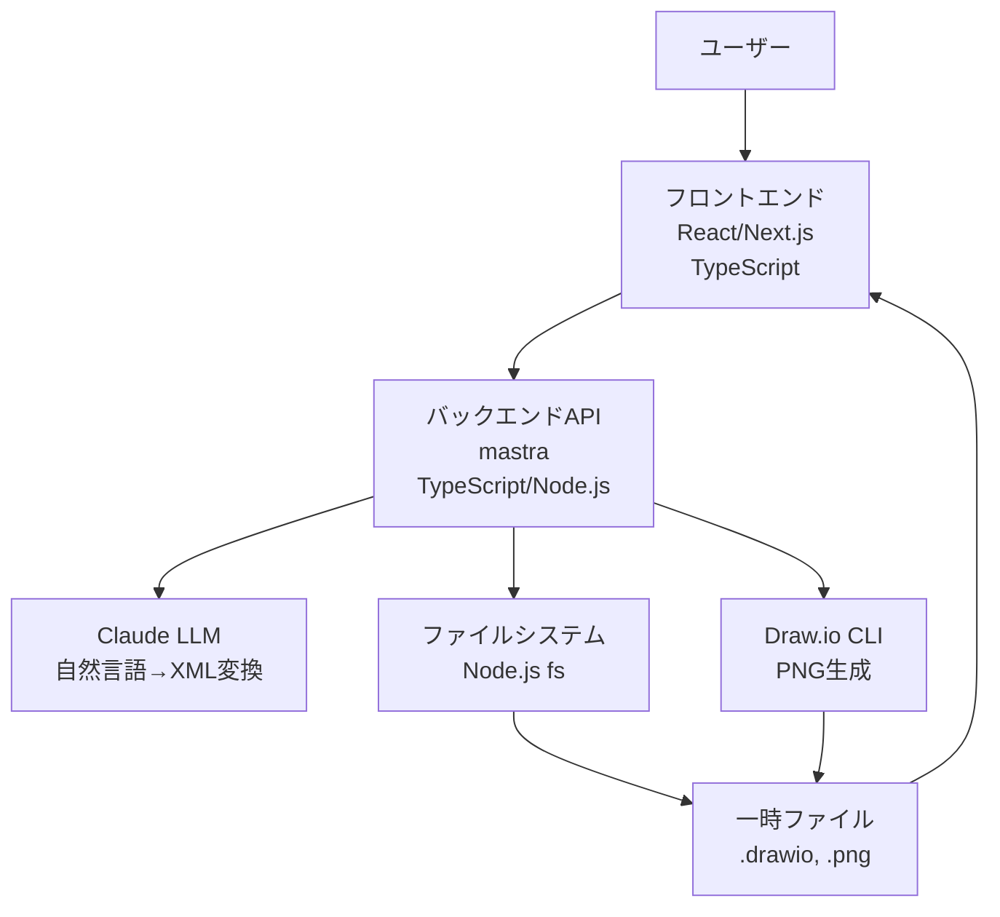

# 設計文書

## 概要

AI作図エージェントシステムは、自然言語入力からDraw.io形式の図を自動生成するWebアプリケーションです。TypeScriptで統一された技術スタックを使用し、mastraフレームワークベースのバックエンドとReact/Next.jsベースのフロントエンドから構成されます。ユーザーは日本語でテキスト入力を行い、LLM（Claude）による解釈を経て、編集可能な.drawioファイルとPNG画像プレビューを取得できます。

## アーキテクチャ

### システム全体構成



### レイヤー構成

1. **プレゼンテーション層**: React/Next.jsベースのWebUI
2. **API層**: mastraフレームワークによるRESTful API
3. **ビジネスロジック層**: 図生成処理、ファイル管理
4. **外部サービス層**: Claude LLM、Draw.io CLI
5. **データ層**: 一時ファイルストレージ

### デプロイメント構成

- **開発環境**: 単一リポジトリでのモノレポ構成
- **フロントエンド**: Next.jsアプリケーション
- **バックエンド**: Node.jsサーバー（mastra）
- **依存関係**: Draw.io CLI（システムレベルインストール）

## コンポーネントと インターフェース

### フロントエンドコンポーネント

#### 1. MainPage コンポーネント
- **責務**: メイン画面の全体レイアウト管理
- **子コンポーネント**: Header, InputForm, ResultDisplay

#### 2. Header コンポーネント
- **責務**: アプリケーションタイトル表示
- **プロパティ**: title: string

#### 3. InputForm コンポーネント
- **責務**: ユーザー入力の受付と送信
- **状態管理**: 
  - inputText: string（入力テキスト）
  - isLoading: boolean（処理中フラグ）
- **イベント**: onSubmit(text: string)

#### 4. ResultDisplay コンポーネント
- **責務**: 生成結果の表示
- **プロパティ**: 
  - imageUrl?: string（PNG画像URL）
  - downloadUrl?: string（.drawioファイルURL）
  - error?: string（エラーメッセージ）

### バックエンドコンポーネント

#### 1. DiagramController
- **責務**: API エンドポイントの処理
- **メソッド**: 
  - generateDiagram(prompt: string): Promise<DiagramResponse>

#### 2. LLMService
- **責務**: Claude LLMとの通信
- **メソッド**: 
  - generateDrawioXML(prompt: string): Promise<string>

#### 3. FileService
- **責務**: ファイル操作の管理
- **メソッド**: 
  - saveDrawioFile(xml: string): Promise<string>
  - generateTempUrl(filePath: string): string
  - cleanupTempFiles(): void

#### 4. ImageService
- **責務**: PNG画像生成
- **メソッド**: 
  - generatePNG(drawioPath: string): Promise<string>

### API インターフェース

#### POST /api/generate-diagram

**リクエスト:**
```typescript
interface DiagramRequest {
  prompt: string;
}
```

**レスポンス:**
```typescript
interface DiagramResponse {
  status: 'success' | 'error';
  imageUrl?: string;
  downloadUrl?: string;
  message?: string;
}
```

## データモデル

### 一時ファイル管理

```typescript
interface TempFile {
  id: string;
  originalName: string;
  path: string;
  type: 'drawio' | 'png';
  createdAt: Date;
  expiresAt: Date;
}
```

### 図生成リクエスト

```typescript
interface DiagramGenerationRequest {
  prompt: string;
  timestamp: Date;
  sessionId?: string; // 将来の拡張用
}
```

### LLM レスポンス

```typescript
interface LLMResponse {
  xml: string;
  metadata?: {
    diagramType: string;
    complexity: number;
  };
}
```

## エラーハンドリング

### エラー分類

1. **入力検証エラー**
   - 空の入力
   - 過度に長い入力
   - 不正な文字

2. **LLMサービスエラー**
   - API接続エラー
   - レート制限エラー
   - 無効なレスポンス

3. **ファイル処理エラー**
   - ディスク容量不足
   - 権限エラー
   - ファイル破損

4. **Draw.io CLIエラー**
   - CLI未インストール
   - 変換失敗
   - 無効なXML

### エラーハンドリング戦略

```typescript
class ErrorHandler {
  static handleLLMError(error: Error): DiagramResponse {
    return {
      status: 'error',
      message: 'AI処理中にエラーが発生しました。しばらく待ってから再試行してください。'
    };
  }

  static handleFileError(error: Error): DiagramResponse {
    return {
      status: 'error',
      message: 'ファイル処理中にエラーが発生しました。'
    };
  }

  static handleValidationError(error: Error): DiagramResponse {
    return {
      status: 'error',
      message: '入力内容を確認してください。'
    };
  }
}
```

### フロントエンドエラー表示

- エラーメッセージの統一的な表示
- ユーザーフレンドリーなメッセージ
- 再試行ボタンの提供

## テスト戦略

### 単体テスト

1. **フロントエンドコンポーネント**
   - React Testing Library使用
   - ユーザーインタラクションのテスト
   - 状態管理のテスト

2. **バックエンドサービス**
   - Jest使用
   - モック化されたLLM/CLI依存関係
   - エラーハンドリングのテスト

### 統合テスト

1. **API エンドポイント**
   - Supertest使用
   - リクエスト/レスポンスの検証
   - エラーケースの検証

2. **ファイル処理フロー**
   - 一時ファイル作成から削除まで
   - PNG生成プロセス
   - URL生成の検証

### E2Eテスト

1. **ユーザーフロー**
   - Playwright使用
   - 入力から結果表示まで
   - ファイルダウンロード機能

### テスト環境設定

```typescript
// テスト用のモック設定
const mockLLMService = {
  generateDrawioXML: jest.fn().mockResolvedValue('<xml>...</xml>')
};

const mockFileService = {
  saveDrawioFile: jest.fn().mockResolvedValue('/tmp/test.drawio'),
  generateTempUrl: jest.fn().mockReturnValue('http://localhost/temp/test.drawio')
};
```

## セキュリティ考慮事項

### 入力検証

- テキスト長制限（例：10,000文字）
- 特殊文字のサニタイゼーション
- XSS攻撃対策

### ファイル管理

- 一時ファイルの自動削除（24時間後）
- ファイルアクセス権限の制限
- ディスク使用量の監視

### API セキュリティ

- レート制限の実装
- CORS設定
- リクエストサイズ制限

## パフォーマンス考慮事項

### フロントエンド最適化

- コンポーネントの遅延読み込み
- 画像の最適化
- バンドルサイズの最小化

### バックエンド最適化

- LLMレスポンスのキャッシュ（将来の拡張）
- 並行処理の活用
- メモリ使用量の最適化

### ファイル処理最適化

- 一時ファイルの効率的な管理
- PNG生成の並列処理
- ガベージコレクションの最適化